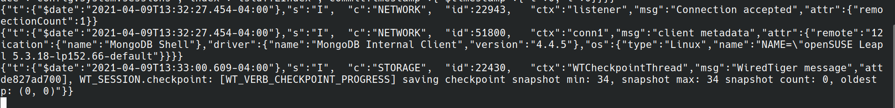
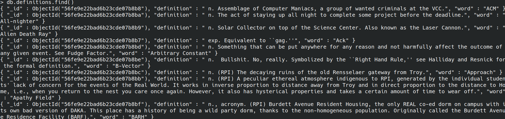
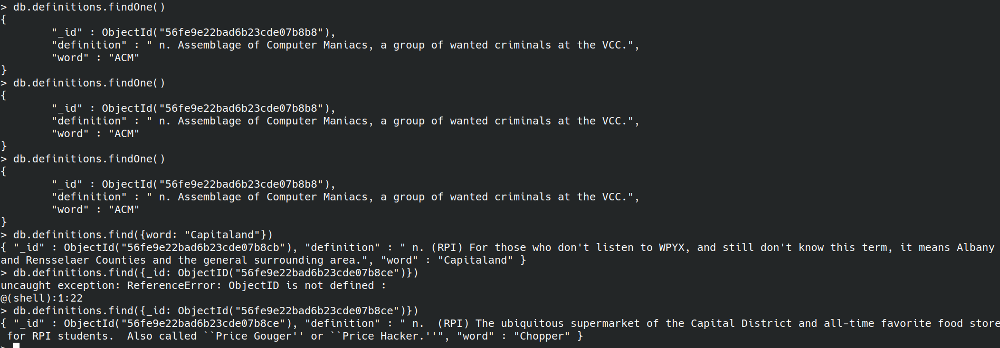
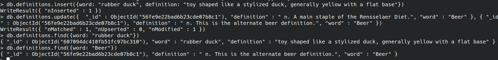
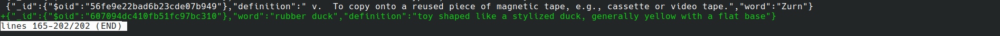
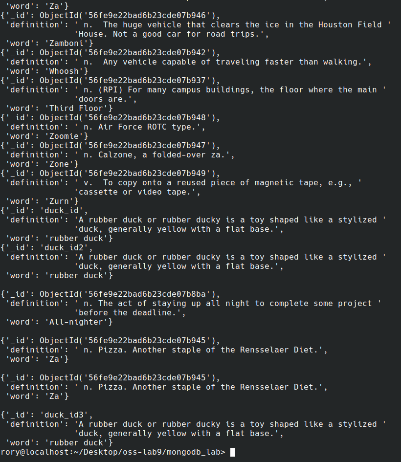

## Checkpoint 0

Here is my paragraph on the MongoDB license change:
https://github.com/roryeiffe/Spoiler-Block/discussions/21

## Checkpoint 1

### Connection Accepted:



### Mongo Terminal Working:


## Checkpoint 2

### CreateCollection Message:


## Checkpoint 3

### Commands:

This command returns all words in the database.
```
db.definitions.find()
```



This command only returns one word from the database.
```
db.definitions.findOne()
```

These last 2 commands return the object in the database whose word is "Capitaland" and whose id is "56fe9e22bad6b23cde07b8ce" respectively.
```
db.definitions.find({word: "Capitaland"}) 
db.definitions.find({_id: ObjectId("56fe9e22bad6b23cde07b8ce")})
```




### Insert and Update commands:
```
db.definitions.insert({word: "rubber duck", definition: "toy shaped like a stylized duck, generally yellow with a flat base"})

db.definitions.update({  "_id" : ObjectId("56fe9e22bad6b23cde07b8c1"), "definition" : " n. A main staple of the Rensselaer Diet.", "word" : "Beer" }, { "_id" : ObjectId("56fe9e22bad6b23cde07b8c1"), "definition" : " n. This is the alternate beer definition.", "word" : "Beer" })
```

### Find these updated words:
```
db.definitions.find({word: "rubber duck"}) 
db.definitions.find({word: "Beer"})
```




### Git Diff:

#### Added Rubber duck:



#### Removed Old Beer Definition:


#### Updated Beer Definition:


## Checkpoint 4

### Script:

```python
from pymongo import MongoClient
from bson.objectid import ObjectId
import pprint
client = MongoClient()

if __name__ == '__main__':
    client = MongoClient('localhost', 27017)
    # Get the database
    db = client.mongo_db_lab
    # Get the collection
    collection = db.definitions
    # Fetch all records:
    for post in collection.find():
    	pprint.pprint(post)
    print()
    # Fetch one record
    pprint.pprint(collection.find_one())
    print()
    # Find specific record:
    pprint.pprint(collection.find_one({"word":"Za"}))
    print()
    # Querying by object id:
    pprint.pprint(collection.find_one({"_id":ObjectId('56fe9e22bad6b23cde07b945')}))
    print()
    # Inserting:
    word = {"word":"rubber duck",
    		"definition": "A rubber duck or rubber ducky is a toy shaped like a stylized duck, generally yellow with a flat base.",
    		"_id":"duck_id3"}
    word_id = collection.insert_one(word).inserted_id
    # print out the word that we inserted:
    pprint.pprint(collection.find_one({"_id": word_id}))
```

### Terminal Output:

You can see the bottom of the fetch_all query. I didn't include the entire thing to save space. There are also a few entries of rubber duck because I made a few mistakes when querying, causing me to reinster with a new id:



