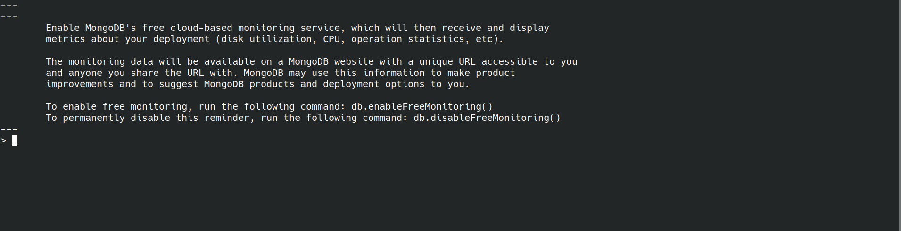

## Checkpoint 0

Here is my paragraph on the MongoDB license change:
https://github.com/roryeiffe/Spoiler-Block/discussions/21

## Checkpoint 1

### Connection Accepted:

### Mongo Terminal Working:

